# Markdown Tutorial: Benchmarking Storage for a Specific Workload in OpenShift

## Introduction

In this tutorial, we will guide you through the process of benchmarking storage for a specific workload in your OpenShift cluster. Benchmarking in this context aims to determine the Input/Output (IO) sizes that are read and written to disk by a particular workload. This information is valuable for estimating the scalability limits of the workload without the need to deploy it at scale. We will focus on the following key aspects:

1. Installation of the Prometheus Exporter for Workload Benchmarking
2. Ensuring Monitoring for the Workload
3. Installation of Grafana to Visualize Workload Metrics
4. Backup of Gathered Workload Information via Prometheus Backup

By the end of this tutorial, you will have the knowledge and tools to perform targeted storage benchmarking for a specific workload within your OpenShift environment.

## Chapter 1: Installation of the Prometheus Exporter for Workload Benchmarking

To benchmark storage for your specific workload, you need to install a Prometheus Exporter tailored to this purpose. Follow these steps:

1. **Login to OpenShift**: Access your OpenShift cluster using your preferred authentication method on the commandline. This is usually done using `oc login`. You can verify that you are logged in with `oc whoami`.

1. **Deploy the eBPF Prometheus Exporter**: Use this cluster's YAML manifest to deploy the eBPF Prometheus Exporter. It will create a new namespace `ebpf-exporter` and deploy everything in there. To apply execute this:

    ```YAML
    oc apply -f https://github.com/mulbc/k8s-storage-profile/raw/main/supporting-files/ebpf-exporter.yaml
    ```

1. **Verify Deployment**: Check the status of deployment with:

    ```SHELL
    oc get daemonset,service --namespace ebpf-exporter
    ```

    The output should look similar to this:

    ```
    NAME                           DESIRED   CURRENT   READY   UP-TO-DATE   AVAILABLE   NODE SELECTOR   AGE
    daemonset.apps/ebpf-exporter   6         6         6       6            6           <none>          60s

    NAME                    TYPE        CLUSTER-IP      EXTERNAL-IP   PORT(S)    AGE
    service/ebpf-exporter   ClusterIP   10.111.16.136   <none>        9435/TCP   59s
    ```

    The desired, current, ready, up-to-date and available counts will depend on the amount of nodes in the cluster. In the above example we had three worker and three control-plane nodes (six nodes in total) in the cluster.

## Chapter 2: Ensuring Monitoring for the Workload

Before diving into benchmarking, it's crucial to verify that the monitoring setup is functioning properly for your specific workload:

1. **Go to OpenShift Web UI Metrics**: Go to your OpenShift Web UI and navigate to Observe --> Metrics in the left Navigation Bar.

    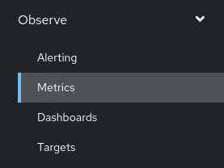

2. **Select ebpf metrics**: Start typing "ebpf in the `Expression` input field. The new metrics should appear immediately and it should look like this:

    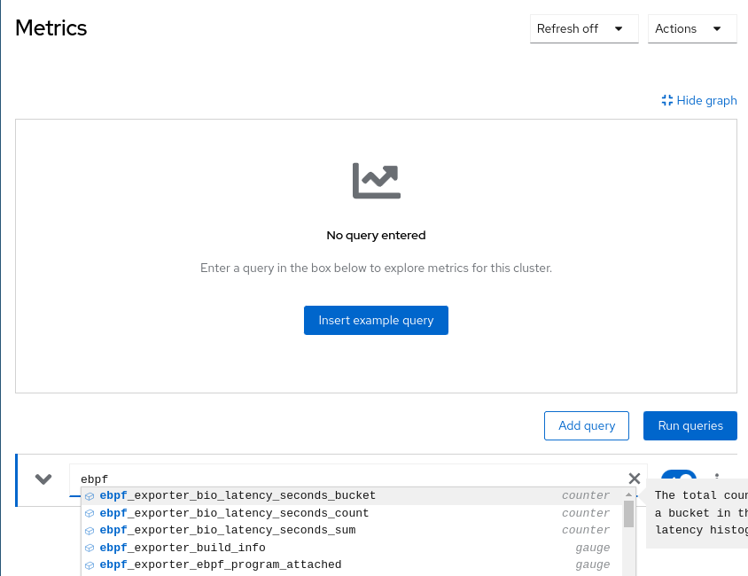
    
    This means everything is working well and you can proceed to the next chapter.

    If no suggestions appear or metrics starting with `ebpf_exporter` are not in the list, something is wrong. Check if the Pods are running, if the service exists and that your Prometheus installation in OpenShift is healthy.

## Chapter 3: Installation of Grafana to Visualize Workload Metrics

To visualize and analyze the storage metrics gathered from your workload, you can use Grafana. Follow these steps:

1. **Install the Grafana Operator**: If the Grafana Operator is not already installed, use OpenShift's OperatorHub to install it:
    1. Search the Operator in OperatorHub
        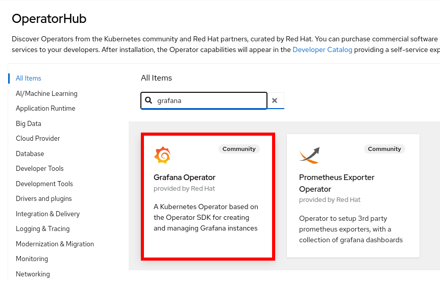
    1. Proceed to install
        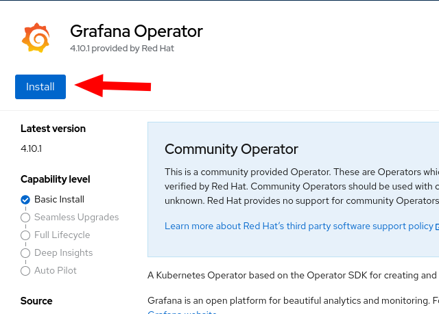
    1. Select v5, leave everything else and click install
        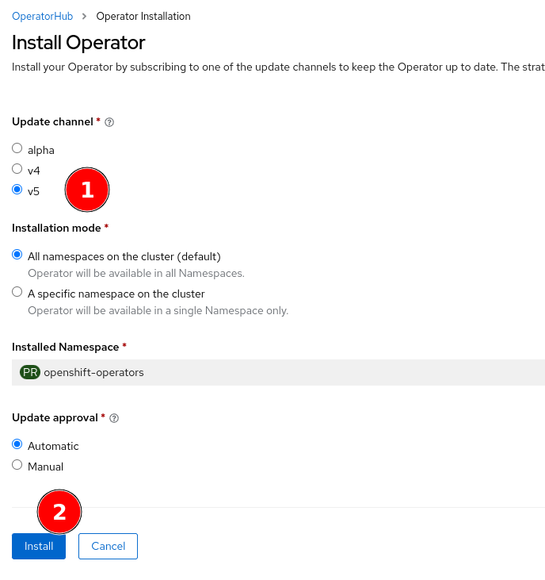
    1. Once finished, click on `View Operator` to proceed
        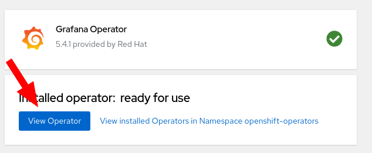

1. **Create a Grafana Instance for Your Workload**: Create a Grafana instance to actually install Grafana in your cluster:
    1. Go to the Grafana tab
        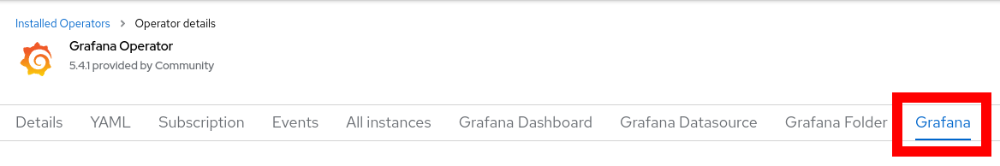
    1. Click on `Create Grafana` on the top right.
    1. Select the YAML view, then set your desired `admin_password` and `admin_user`.
        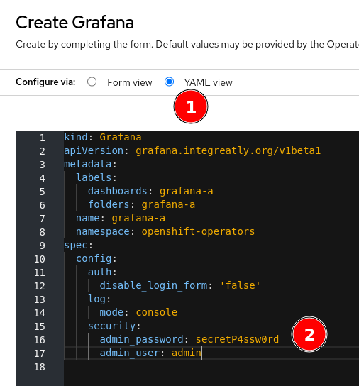
    1. Finish by clicking on `Create` at the bottom.

1. **Connect Grafana to OpenShift Monitoring**: Grafana needs special access permissions to access the cluster metrics:
    1. Allow the Grafana Service Account to view the system metrics:
        ```SHELL
        oc adm policy add-cluster-role-to-user cluster-monitoring-view -z grafana-a-sa
        ```
    1. Get a token for Grafana with these access levels:
        ```SHELL
        export BEARER_TOKEN="$(oc create token grafana-a-sa --duration=8760h -n openshift-operators )"
        ```
    1. If the above fails, make sure to update your local `oc` binary and that you are using OpenShift 4.11 and above!
    1. Create the Grafana Data Source like this:
        ```SHELL
        cat <<EOF | oc create -f -
        apiVersion: grafana.integreatly.org/v1beta1
        kind: GrafanaDatasource
        metadata:
            name: grafanadatasource-cluster
            namespace: openshift-operators
        spec:
            datasource:
                jsonData:
                timeInterval: 5s
                tlsSkipVerify: true
                httpHeaderName1: 'Authorization'
                access: proxy
                editable: true
                isDefault: true
                name: Prometheus
                secureJsonData:
                    httpHeaderValue1: 'Bearer ${BEARER_TOKEN}'
                type: prometheus
                url: 'https://thanos-querier.openshift-monitoring.svc.cluster.local:9091'
            instanceSelector:
                matchLabels:
                dashboards: grafana-a
        EOF
        ```


1. **Access the Grafana Dashboard**: Access the Grafana dashboard from your web browser and configure it to display the workload-specific metrics collected by Prometheus.
    1. Go to Networking --> Routes in the OpenShift Web UI to create a route for your new Grafana instance
        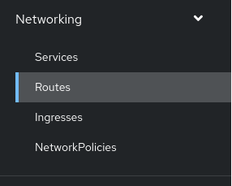
    1. Click on `Create Route` on the top right
    1. Configure your new route:
        1. Make sure you are in the `openshift-operators` namespace
        1. Use a name for the route that corresponds with what you are trying to do
        1. Select the Service of your new Grafana instance
        1. Select Port 3000 of your Grafana instance
        1. Finish by clicking on `Create` at the bottom.
    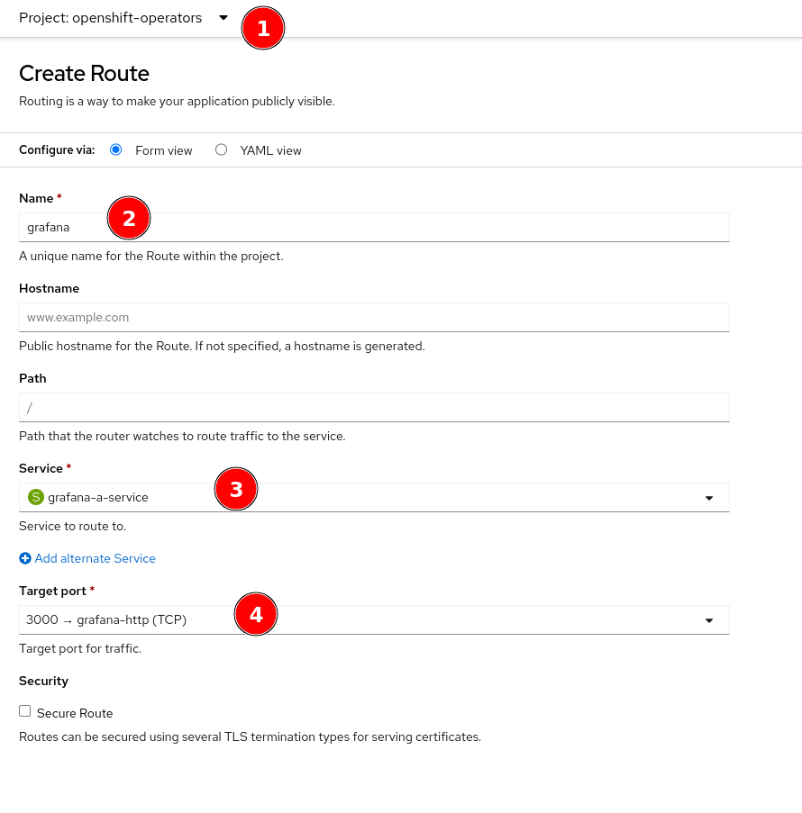
    1. You will now see your new Route, including the URL to your new Grafana instance.
        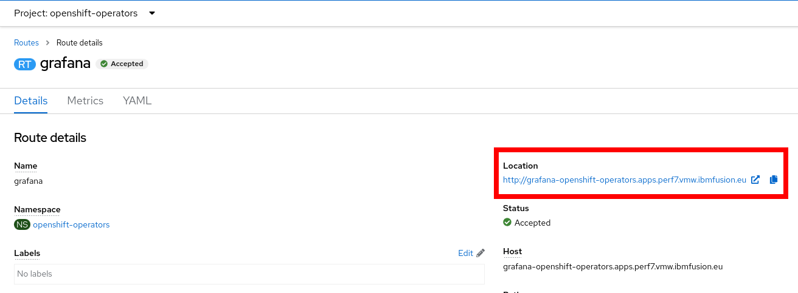
    **Be aware** that our route is `http://` and your browser might try to forward you to `https://`, which will not work!

1. **Install the eBPF dashboard** In order to make sense of our new histogram metrics, we need to use a custom Grafana Dashboard. This repository contains this Dashboard in JSON format for easy import:
    1. Apply the YAML manifest in this repository to install the Dashboard:
        ```SHELL
        oc apply -f https://github.com/mulbc/k8s-storage-profile/raw/main/supporting-files/grafana-dashboard.yaml
        ```
    1. You should soon see the new eBPF dashboard in the openshift-operators folder. It will start populating with data over time
        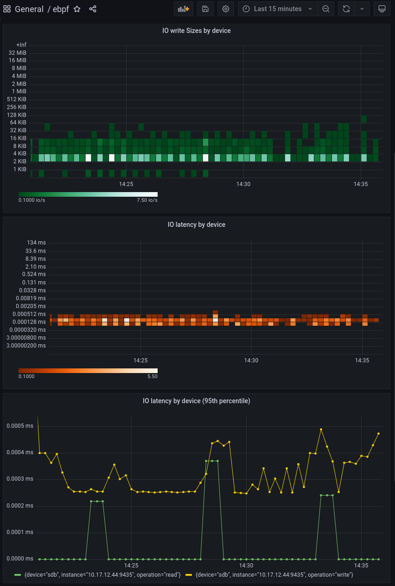


## Chapter 4: Backup of Gathered Workload Information via Prometheus Backup

TODO